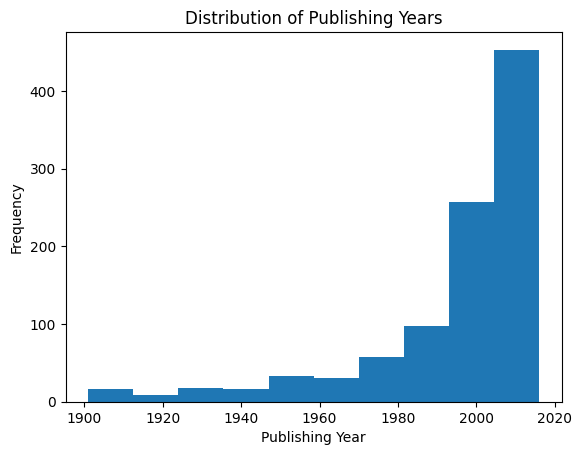
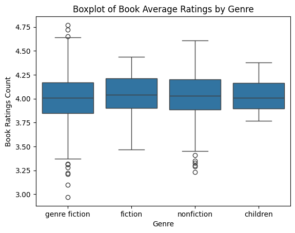
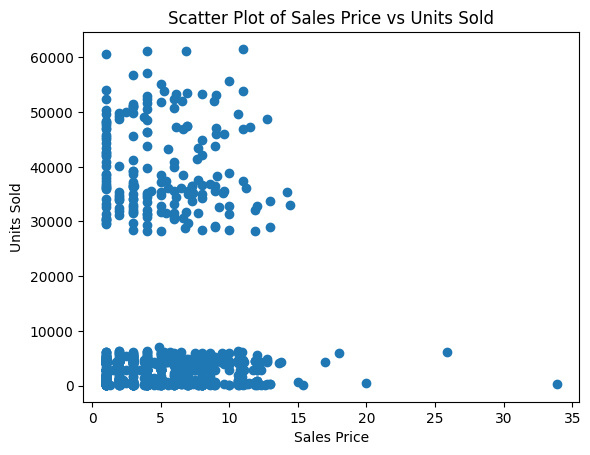
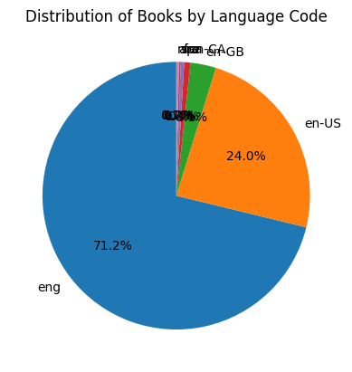
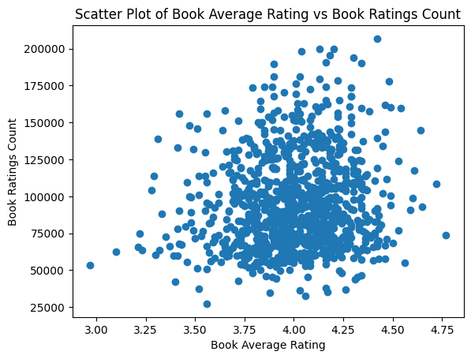
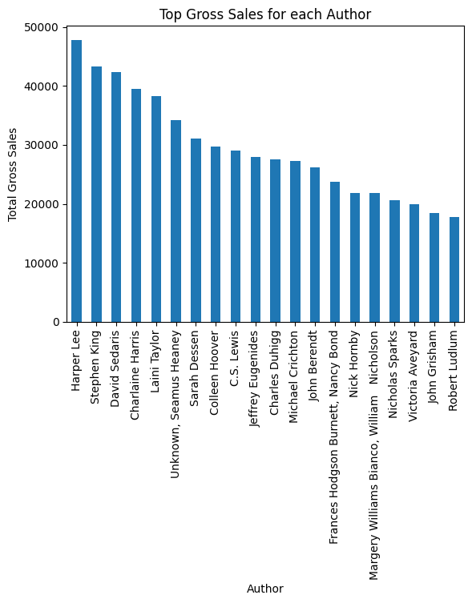
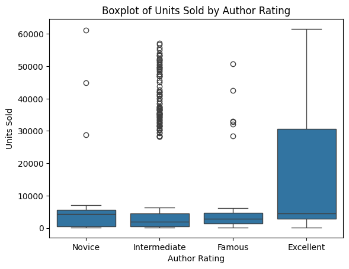
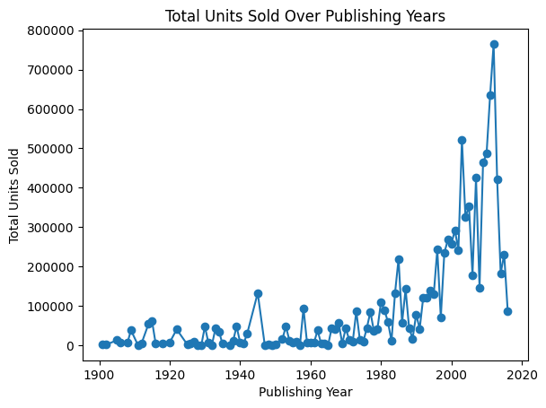

# 📚 Book Sales Exploratory Data Analysis

## 📌 Project Overview
This project analyzes a book sales dataset to identify trends in publishing years, genres, author performance, ratings, pricing, language distribution, and sales volume.  
The goal is to generate data-driven insights that can support decision-making in publishing, marketing, and pricing strategies.

---

## 🎯 Objectives
- Analyze long-term publishing and sales trends  
- Understand genre-wise distribution and performance  
- Examine relationships between price, ratings, and units sold  
- Identify top-performing authors based on gross sales  
- Analyze the impact of author reputation on sales outcomes  

---

## 🛠️ Tools & Technologies
- Python (Pandas, NumPy)
- Matplotlib & Seaborn
- Jupyter Notebook
- Git & GitHub

---

## 📊 Key Analysis
- **Trend Analysis:** Publishing year vs total units sold  
- **Genre Analysis:** Book counts and rating distributions by genre  
- **Sales Analysis:** Price vs units sold relationship  
- **Author Analysis:** Gross sales and reputation-based performance  
- **Language Analysis:** Distribution of books by language code  

---

## 📈 Analysis Sections
1. Publishing Trends Over Time  
2. Genre Distribution & Ratings  
3. Price vs Sales Performance  
4. Author Performance Analysis  
5. Language Distribution of Books  

---

## 📸 Visualization Preview

### 1️⃣ Publishing Year Distribution

### 2️⃣ Number of Books per Genre

### 3️⃣ Average Ratings by Genre

### 4️⃣ Sales Price vs Units Sold

### 5️⃣ Language Distribution

### 6️⃣ Rating vs Ratings Count

### 7️⃣ Top Gross Sales by Author

### 8️⃣ Units Sold by Author Rating

### 9️⃣ Total Units Sold Over Publishing Years

---

## 🔍 Key Insights
- Genre Fiction dominates both book count and overall sales  
- Lower-priced books generally achieve higher unit sales  
- Author reputation has a strong influence on sales performance  
- Most books receive average ratings between 3.5 and 4.5  
- English-language books overwhelmingly dominate the dataset  

---

## 🚀 Outcome
This project demonstrates end-to-end data analytics skills including:
- Data cleaning and preparation  
- Exploratory data analysis (EDA)  
- Insight-driven visualization and storytelling  
- Structuring analytics projects for GitHub portfolios  

---

## 📜 License
MIT © Gaurav Dogra
